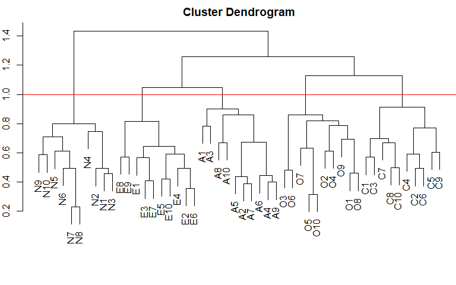
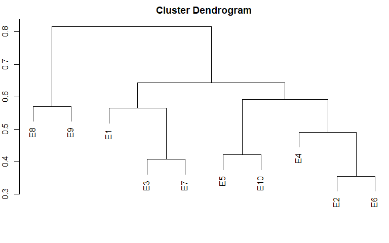
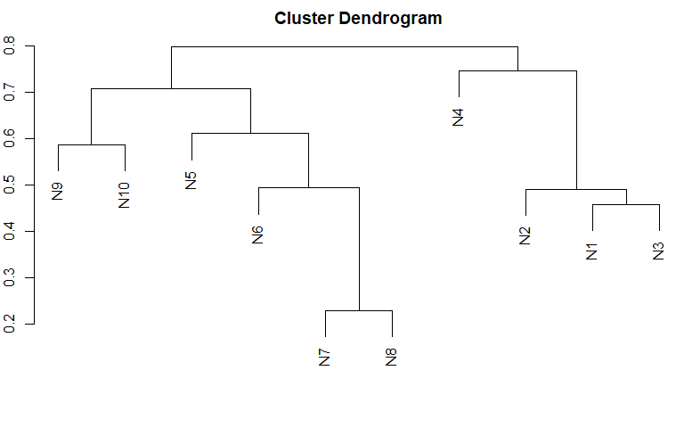
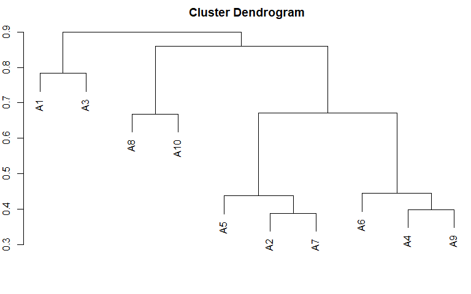
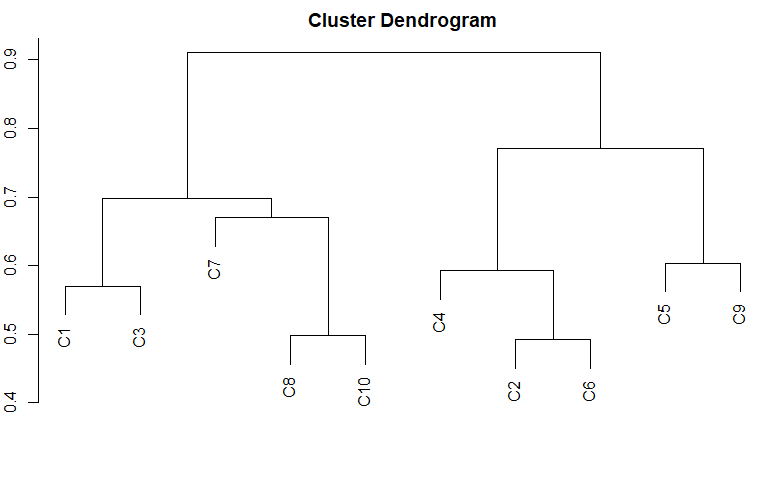
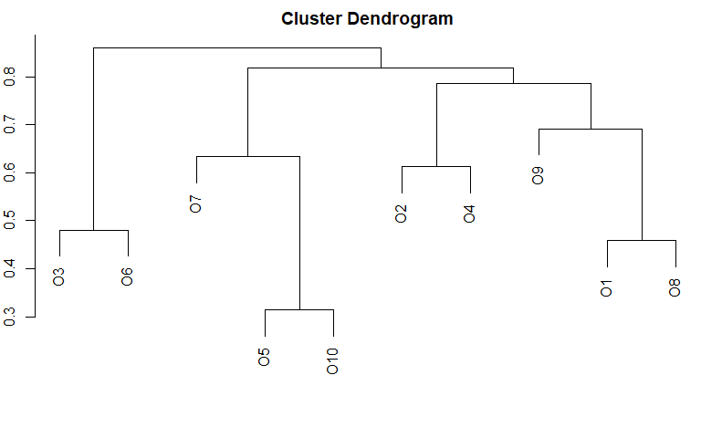

# maybe bootstrap the clusters to have 95%CIs?

This mini project is a validation of the Big Five Personality test, and
serves the purpose of establishing my own ability to visualise and
assess factor structures. This project will take a more niche approach
using cluster analyses to visually display factor structures based on
the closeness of correlation distances of items. Additionally,
inter-factor structures will be visualised and outliers and groupings
will be assessed.

# Aims and Objectives

This project aims to visually confirm the factor structure of the Big
Five personality test using hierarchical cluster analysis rather than
traditional factor-analytic techniques. The analysis examines both the
overall factor structure and the sub-structure within each domain. This
approach serves two purposes: validating the expected five-factor
solution and exploring whether theoretically meaningful sub-clusters
emerge within each dimension.

# Methods

The analysis comprised several hierarchical cluster analyses using the
stats R package (R Core Team, 2026). All data were first converted into
a distance matrix using correlation-based dissimilarity (1 − Pearson’s
r), and hierarchical clustering was conducted with complete linkage.
This correlation distance approach permits clustering based on the
relationships among items rather than among respondents.

# Sampling and Data

The data was drawn from the openpsychometrics Big Five personality test
(Goldberg, 1992) and a sample of N = 150 was chosen at random have 30
per expected subgroup, an amount found to have sufficient power when
cluster separation is large (Dalmaijer et al., 2022). Further as all
answers were in the same Likert format no transformations were conducted
except inverting reverse scored items before the correlation matrix was
created.

# Results

Descriptive statistics are as follows:

#### Table 1

**Descriptives**

    ##     vars   n mean   sd median trimmed  mad min max range  skew kurtosis   se
    ## E1     1 150 2.93 1.29      3    2.91 1.48   1   5     4  0.02    -1.06 0.10
    ## E2     2 150 3.22 1.36      3    3.28 1.48   1   5     4 -0.22    -1.15 0.11
    ## E3     3 150 3.50 1.22      4    3.59 1.48   1   5     4 -0.44    -0.79 0.10
    ## E4     4 150 2.92 1.26      3    2.90 1.48   1   5     4  0.05    -1.03 0.10
    ## E5     5 150 3.51 1.30      4    3.62 1.48   1   5     4 -0.44    -1.03 0.11
    ## E6     6 150 3.63 1.29      4    3.79 1.48   1   5     4 -0.73    -0.54 0.11
    ## E7     7 150 3.07 1.49      3    3.08 1.48   1   5     4 -0.11    -1.43 0.12
    ## E8     8 150 2.50 1.20      3    2.42 1.48   1   5     4  0.33    -0.79 0.10
    ## E9     9 150 3.29 1.33      3    3.36 1.48   1   5     4 -0.21    -1.22 0.11
    ## E10   10 150 2.54 1.33      2    2.44 1.48   1   5     4  0.34    -1.17 0.11
    ## N1    11 150 3.30 1.26      3    3.37 1.48   1   5     4 -0.25    -1.05 0.10
    ## N2    12 150 2.81 1.16      3    2.77 1.48   1   5     4  0.25    -0.80 0.09
    ## N3    13 150 3.85 1.14      4    3.98 1.48   1   5     4 -0.73    -0.45 0.09
    ## N4    14 150 3.17 1.30      3    3.22 1.48   1   5     4 -0.28    -1.01 0.11
    ## N5    15 150 3.09 1.19      3    3.11 1.48   1   5     4 -0.07    -0.96 0.10
    ## N6    16 150 2.95 1.31      3    2.94 1.48   1   5     4  0.12    -1.17 0.11
    ## N7    17 150 3.01 1.36      3    3.02 1.48   1   5     4  0.09    -1.26 0.11
    ## N8    18 150 2.66 1.40      2    2.58 1.48   1   5     4  0.31    -1.25 0.11
    ## N9    19 150 2.99 1.28      3    2.98 1.48   1   5     4 -0.03    -1.14 0.10
    ## N10   20 150 2.79 1.36      3    2.73 1.48   1   5     4  0.18    -1.24 0.11
    ## A1    21 150 3.61 1.42      4    3.76 1.48   1   5     4 -0.64    -0.97 0.12
    ## A2    22 150 3.99 1.07      4    4.17 1.48   1   5     4 -1.14     0.81 0.09
    ## A3    23 150 3.86 1.19      4    4.00 1.48   1   5     4 -0.77    -0.52 0.10
    ## A4    24 150 4.08 1.06      4    4.28 1.48   1   5     4 -1.27     1.11 0.09
    ## A5    25 150 3.83 1.22      4    3.98 1.48   1   5     4 -0.84    -0.42 0.10
    ## A6    26 150 4.03 1.10      4    4.21 1.48   1   5     4 -1.05     0.28 0.09
    ## A7    27 150 3.98 1.05      4    4.14 1.48   1   5     4 -1.03     0.49 0.09
    ## A8    28 150 3.84 1.03      4    3.97 1.48   1   5     4 -0.85     0.27 0.08
    ## A9    29 150 3.98 1.08      4    4.15 1.48   1   5     4 -1.11     0.62 0.09
    ## A10   30 150 3.61 1.13      4    3.68 1.48   1   5     4 -0.39    -0.81 0.09
    ## C1    31 150 3.27 1.19      3    3.33 1.48   1   5     4 -0.35    -0.78 0.10
    ## C2    32 150 2.99 1.38      3    2.98 1.48   1   5     4  0.13    -1.31 0.11
    ## C3    33 150 4.04 1.08      4    4.21 1.48   1   5     4 -1.03     0.23 0.09
    ## C4    34 150 3.50 1.24      4    3.59 1.48   1   5     4 -0.46    -0.88 0.10
    ## C5    35 150 2.69 1.25      3    2.62 1.48   1   5     4  0.21    -1.01 0.10
    ## C6    36 150 3.23 1.42      3    3.29 1.48   1   5     4 -0.16    -1.33 0.12
    ## C7    37 150 3.72 1.17      4    3.84 1.48   1   5     4 -0.61    -0.47 0.10
    ## C8    38 150 3.57 1.22      4    3.67 1.48   1   5     4 -0.40    -0.78 0.10
    ## C9    39 150 3.30 1.26      4    3.38 1.48   1   5     4 -0.33    -0.98 0.10
    ## C10   40 150 3.84 1.02      4    3.94 1.48   1   5     4 -0.71     0.16 0.08
    ## O1    41 150 3.61 1.12      4    3.69 1.48   1   5     4 -0.48    -0.62 0.09
    ## O2    42 150 3.97 1.05      4    4.11 1.48   1   5     4 -0.81     0.00 0.09
    ## O3    43 150 4.15 1.03      4    4.32 1.48   1   5     4 -1.13     0.52 0.08
    ## O4    44 150 3.97 1.02      4    4.10 1.48   1   5     4 -0.84     0.20 0.08
    ## O5    45 150 3.91 0.91      4    3.99 1.48   1   5     4 -0.94     1.19 0.07
    ## O6    46 150 4.15 1.15      5    4.38 0.00   1   5     4 -1.39     1.04 0.09
    ## O7    47 150 4.03 0.95      4    4.13 1.48   1   5     4 -0.71    -0.23 0.08
    ## O8    48 150 3.18 1.25      3    3.22 1.48   1   5     4 -0.14    -1.04 0.10
    ## O9    49 150 4.19 0.92      4    4.33 1.48   1   5     4 -1.16     1.09 0.07
    ## O10   50 150 4.09 1.02      4    4.24 1.48   1   5     4 -1.01     0.37 0.08

## Hierarchical Clustering Graphs

The cluster dendrogram for the FFM revealed a clear five-factor
structure, with each cluster containing items exclusively from its
corresponding dimension, confirming the expected factor solution.

#### **Figure 1**

*CLuster Dendogram for FFM*

    ## NULL

*Note*. The red line visually indicates the cut off at 5 clusters.

The dendogram cut off at 5 clusters and produced the following item
bins:

#### **Table 2**

*Global Cluster Cut-off at 5*

    ## $`1`
    ##  [1] "E1"  "E2"  "E3"  "E4"  "E5"  "E6"  "E7"  "E8"  "E9"  "E10"
    ## 
    ## $`2`
    ##  [1] "N1"  "N2"  "N3"  "N4"  "N5"  "N6"  "N7"  "N8"  "N9"  "N10"
    ## 
    ## $`3`
    ##  [1] "A1"  "A2"  "A3"  "A4"  "A5"  "A6"  "A7"  "A8"  "A9"  "A10"
    ## 
    ## $`4`
    ##  [1] "C1"  "C2"  "C3"  "C4"  "C5"  "C6"  "C7"  "C8"  "C9"  "C10"
    ## 
    ## $`5`
    ##  [1] "O1"  "O2"  "O3"  "O4"  "O5"  "O6"  "O7"  "O8"  "O9"  "O10"

## Inter-factor Clusters

To assess if there are inter-factor differences in items each set of
items was separated and inspected visually for groupings.

### Extroversion

The descriptive statistics for the extroversion items only are displayed
below:

#### **Table 3**

*Descriptives for Extroversion Only*

    ##     vars   n mean   sd median trimmed  mad min max range  skew kurtosis   se
    ## E1     1 150 2.93 1.29      3    2.91 1.48   1   5     4  0.02    -1.06 0.10
    ## E2     2 150 3.22 1.36      3    3.28 1.48   1   5     4 -0.22    -1.15 0.11
    ## E3     3 150 3.50 1.22      4    3.59 1.48   1   5     4 -0.44    -0.79 0.10
    ## E4     4 150 2.92 1.26      3    2.90 1.48   1   5     4  0.05    -1.03 0.10
    ## E5     5 150 3.51 1.30      4    3.62 1.48   1   5     4 -0.44    -1.03 0.11
    ## E6     6 150 3.63 1.29      4    3.79 1.48   1   5     4 -0.73    -0.54 0.11
    ## E7     7 150 3.07 1.49      3    3.08 1.48   1   5     4 -0.11    -1.43 0.12
    ## E8     8 150 2.50 1.20      3    2.42 1.48   1   5     4  0.33    -0.79 0.10
    ## E9     9 150 3.29 1.33      3    3.36 1.48   1   5     4 -0.21    -1.22 0.11
    ## E10   10 150 2.54 1.33      2    2.44 1.48   1   5     4  0.34    -1.17 0.11

The dendrogram for Extroversion revealed three broad clusters. Notably,
E8 (“I don’t like to draw attention to myself”) and E9 (“I don’t mind
being the center of attention”) grouped late into the factor, suggesting
they are somewhat distinct from other Extroversion items. This may
reflect cultural norms around attention-seeking, where items tapping
this aspect may be perceived differently, or answered more variably,
than items tapping sociability or talkativeness. For example, items
around attention may be perceived as negative, such as the attention
seeker being someone who is looked down upon.

#### **Figure 2**

*Cluster Dendogram for Extroversion*

When cut at four clusters, the Extroversion items grouped into four
interpretable sub-domains.

The first cluster comprised E1 (“I am the life of the party”), E3 (“I
feel comfortable around people”), and E7 (“I talk to a lot of different
people at parties”), reflecting social engagement and comfort in group
settings. The second cluster contained the negatively worded items E2
(“I don’t talk a lot”), E4 (“I keep in the background”), and E6 (“I have
little to say”), which collectively tap social withdrawal and low verbal
output. The third cluster grouped E5 (“I start conversations”) with E10
(“I am quiet around strangers”), suggesting a sub-domain related to
behaviour specifically in unfamiliar social contexts. Finally, the
fourth cluster comprised E8 (“I don’t like to draw attention to myself”)
and E9 (“I don’t mind being the center of attention”), capturing
attention-seeking versus attention-avoidance tendencies.

Other than E4 (“I keep in the background”) not grouping with E10 (“I am
quiet around strangers”) despite their conceptual similarity, the
Extroversion factor divided cleanly into four sub-domains that broadly
map onto aspects of sociability, assertiveness, and activity level.

#### **Table 4**

*Cluster Cut-off for Extroversion*

    ## $`1`
    ## [1] "E1" "E3" "E7"
    ## 
    ## $`2`
    ## [1] "E2" "E4" "E6"
    ## 
    ## $`3`
    ## [1] "E5"  "E10"
    ## 
    ## $`4`
    ## [1] "E8" "E9"

### Neuroticism

#### **Table 5** 

*Descriptives for Neuroticism Only*

    ##     vars   n mean   sd median trimmed  mad min max range  skew kurtosis   se
    ## N1     1 150 3.30 1.26      3    3.37 1.48   1   5     4 -0.25    -1.05 0.10
    ## N2     2 150 2.81 1.16      3    2.77 1.48   1   5     4  0.25    -0.80 0.09
    ## N3     3 150 3.85 1.14      4    3.98 1.48   1   5     4 -0.73    -0.45 0.09
    ## N4     4 150 3.17 1.30      3    3.22 1.48   1   5     4 -0.28    -1.01 0.11
    ## N5     5 150 3.09 1.19      3    3.11 1.48   1   5     4 -0.07    -0.96 0.10
    ## N6     6 150 2.95 1.31      3    2.94 1.48   1   5     4  0.12    -1.17 0.11
    ## N7     7 150 3.01 1.36      3    3.02 1.48   1   5     4  0.09    -1.26 0.11
    ## N8     8 150 2.66 1.40      2    2.58 1.48   1   5     4  0.31    -1.25 0.11
    ## N9     9 150 2.99 1.28      3    2.98 1.48   1   5     4 -0.03    -1.14 0.10
    ## N10   10 150 2.79 1.36      3    2.73 1.48   1   5     4  0.18    -1.24 0.11

Neuroticism does not cleanly break into clusters like Extroversion but
rather has an item (N4) that breaks effectively into 2 clusters. Cluster
1 contains N1 (“I get stressed out easily”), N2 (“I am relaxed most of
the time”), N3 (“I worry about things”), and N4 (“N4 I seldom feel
blue”). Items 1 to 3 in neuroticism directly relate to stress levels and
worry. the inclusion of N4 will be discussed.

Cluster 2 contains N5 (“I am easily disturbed”), N6 (“I get upset
easily”), N7 (“I change my mood a lot”), N8 (“I have frequent mood
swings”), N9 (“I get irritated easily”), and N10 (“I often feel blue”).
This cluster can be described as having two major themes. External
effect on self and mood.

#### **Figure 3**

*Cluster Dendogram for Neuroticism*

#### **Table 6**

*Cluster Cut-off for Neuroticism: 2 Clusters*

    ## $`1`
    ## [1] "N1" "N2" "N3" "N4"
    ## 
    ## $`2`
    ## [1] "N5"  "N6"  "N7"  "N8"  "N9"  "N10"

Note that splitting the clusters into 3 only removes N4. N4 also relates
in item wording most to N10, both refering to feeling blue. The issue
with connectedness may be due to the use of the word “seldom” in N4,
which has generally fallen out of the modern English vernacular. It may
be that this item is not fully understood by participants and therefore,
it is answered in a more varied manner.

#### **Table 7**

*Cluster Cut-off for Neuroticism: 3 Clusters*

    ## $`1`
    ## [1] "N1" "N2" "N3"
    ## 
    ## $`2`
    ## [1] "N4"
    ## 
    ## $`3`
    ## [1] "N5"  "N6"  "N7"  "N8"  "N9"  "N10"

Further, N4 doesn’t merge with N10 until the last step which suggests
they have a large distance between them. Given they are functionally the
same question but negatively worded, the discrepancy is likely due to
misunderstanding of what is being asked.

### Agreeableness

#### **Table 8**

*Descriptives for Agreeableness Only*

    ##     vars   n mean   sd median trimmed  mad min max range  skew kurtosis   se
    ## A1     1 150 3.61 1.42      4    3.76 1.48   1   5     4 -0.64    -0.97 0.12
    ## A2     2 150 3.99 1.07      4    4.17 1.48   1   5     4 -1.14     0.81 0.09
    ## A3     3 150 3.86 1.19      4    4.00 1.48   1   5     4 -0.77    -0.52 0.10
    ## A4     4 150 4.08 1.06      4    4.28 1.48   1   5     4 -1.27     1.11 0.09
    ## A5     5 150 3.83 1.22      4    3.98 1.48   1   5     4 -0.84    -0.42 0.10
    ## A6     6 150 4.03 1.10      4    4.21 1.48   1   5     4 -1.05     0.28 0.09
    ## A7     7 150 3.98 1.05      4    4.14 1.48   1   5     4 -1.03     0.49 0.09
    ## A8     8 150 3.84 1.03      4    3.97 1.48   1   5     4 -0.85     0.27 0.08
    ## A9     9 150 3.98 1.08      4    4.15 1.48   1   5     4 -1.11     0.62 0.09
    ## A10   10 150 3.61 1.13      4    3.68 1.48   1   5     4 -0.39    -0.81 0.09

#### **Figure 4**

*Cluster Dendogram for Agreeableness*

Agreeableness splits into three distinct clusters with A1 (“I feel
little concern for others”) and A3 (“I insult people”) being
particularly far from other items. These items are phrased quite
negatively, in that insulting and showing little empathy towards others
is often seen as a taboo. Compared to the second cluster containing; A2
(“I am interested in people”), A4 (“I sympathize with others’
feelings.”), A5 (“I am not interested in other people’s problems”), A6
(“I have a soft heart”), A7 (“I am not really interested in others”), A8
(“I take time out for others”), and A9 (“I feel others’ emotions”) and
the third cluster containing; A8 (“I take time out for others”) and A10
(“I make people feel at ease”) the effect of a social desirability bias
may be of greater impact due to strong words such as “little concern”
and “insult. However, all the items used for agreeableness may induce
some level of social desirability bias given the social nature and
implications of being a”bad” person.

Additionally, cluster two mainly regards interest in others with A6
being a potential outlier contextually. Considering it most closely
connects with A4 and A9 which both concern the emotions of others, a
soft heart may resonate most with those who tend to feel and care about
others’ emotions.

#### **Table 9**

*Cluster Cut-off for Agreeableness*

    ## $`1`
    ## [1] "A1" "A3"
    ## 
    ## $`2`
    ## [1] "A2" "A4" "A5" "A6" "A7" "A9"
    ## 
    ## $`3`
    ## [1] "A8"  "A10"

### Conscientiousness

#### **Table 10**

*Descriptives for Conscientiousness Only*

    ##     vars   n mean   sd median trimmed  mad min max range  skew kurtosis   se
    ## C1     1 150 3.27 1.19      3    3.33 1.48   1   5     4 -0.35    -0.78 0.10
    ## C2     2 150 2.99 1.38      3    2.98 1.48   1   5     4  0.13    -1.31 0.11
    ## C3     3 150 4.04 1.08      4    4.21 1.48   1   5     4 -1.03     0.23 0.09
    ## C4     4 150 3.50 1.24      4    3.59 1.48   1   5     4 -0.46    -0.88 0.10
    ## C5     5 150 2.69 1.25      3    2.62 1.48   1   5     4  0.21    -1.01 0.10
    ## C6     6 150 3.23 1.42      3    3.29 1.48   1   5     4 -0.16    -1.33 0.12
    ## C7     7 150 3.72 1.17      4    3.84 1.48   1   5     4 -0.61    -0.47 0.10
    ## C8     8 150 3.57 1.22      4    3.67 1.48   1   5     4 -0.40    -0.78 0.10
    ## C9     9 150 3.30 1.26      4    3.38 1.48   1   5     4 -0.33    -0.98 0.10
    ## C10   10 150 3.84 1.02      4    3.94 1.48   1   5     4 -0.71     0.16 0.08

#### **Figure 5**

*Cluster Dendogram for Conscientiousness*

#### **Table 11**

*Cluster Cut-off for Conscientiousness*

    ## $`1`
    ## [1] "C1" "C3"
    ## 
    ## $`2`
    ## [1] "C2" "C4" "C6"
    ## 
    ## $`3`
    ## [1] "C5" "C9"
    ## 
    ## $`4`
    ## [1] "C7"  "C8"  "C10"

### Openness to Experience

#### **Table 12** 

*Descriptives for Openness to Experience Only*

    ##     vars   n mean   sd median trimmed  mad min max range  skew kurtosis   se
    ## O1     1 150 3.61 1.12      4    3.69 1.48   1   5     4 -0.48    -0.62 0.09
    ## O2     2 150 3.97 1.05      4    4.11 1.48   1   5     4 -0.81     0.00 0.09
    ## O3     3 150 4.15 1.03      4    4.32 1.48   1   5     4 -1.13     0.52 0.08
    ## O4     4 150 3.97 1.02      4    4.10 1.48   1   5     4 -0.84     0.20 0.08
    ## O5     5 150 3.91 0.91      4    3.99 1.48   1   5     4 -0.94     1.19 0.07
    ## O6     6 150 4.15 1.15      5    4.38 0.00   1   5     4 -1.39     1.04 0.09
    ## O7     7 150 4.03 0.95      4    4.13 1.48   1   5     4 -0.71    -0.23 0.08
    ## O8     8 150 3.18 1.25      3    3.22 1.48   1   5     4 -0.14    -1.04 0.10
    ## O9     9 150 4.19 0.92      4    4.33 1.48   1   5     4 -1.16     1.09 0.07
    ## O10   10 150 4.09 1.02      4    4.24 1.48   1   5     4 -1.01     0.37 0.08

#### **Figure 6**

*Cluster Dendogram for Openness to Experience*

#### **Table 13**

*Cluster Cut-off for Openness to Experience*

    ## $`1`
    ## [1] "O1" "O8" "O9"
    ## 
    ## $`2`
    ## [1] "O2" "O4"
    ## 
    ## $`3`
    ## [1] "O3" "O6"
    ## 
    ## $`4`
    ## [1] "O5"  "O7"  "O10"

O7 I am quick to understand things.

# Discussion

# References

Dalmaijer, E. S., Nord, C. L., & Astle, D. E. (2022). Statistical power
for cluster analysis. BMC Bioinformatics, 23(1), 205.
<https://doi.org/10.1186/s12859-022-04675-1>

Goldberg, L. R. (1992). The development of markers for the Big-Five
factor structure. Psychological Assessment, 4(1), 26–42.
<https://doi.org/10.1037/1040-3590.4.1.26>

# Appendix

## FFM Questions

### Extroversion

E1 I am the life of the party.

E2 I don’t talk a lot.

E3 I feel comfortable around people.

E4 I keep in the background.

E5 I start conversations.

E6 I have little to say.

E7 I talk to a lot of different people at parties.

E8 I don’t like to draw attention to myself.

E9 I don’t mind being the center of attention.

E10 I am quiet around strangers.

### Neuroticism

N1 I get stressed out easily.

N2 I am relaxed most of the time.

N3 I worry about things.

N4 I seldom feel blue.

N5 I am easily disturbed.

N6 I get upset easily.

N7 I change my mood a lot.

N8 I have frequent mood swings.

N9 I get irritated easily.

N10 I often feel blue.

### Agreeableness

A1 I feel little concern for others.

A2 I am interested in people.

A3 I insult people.

A4 I sympathize with others’ feelings.

A5 I am not interested in other people’s problems.

A6 I have a soft heart.

A7 I am not really interested in others.

A8 I take time out for others.

A9 I feel others’ emotions.

A10 I make people feel at ease.

### Conscientiousness

C1 I am always prepared.

C2 I leave my belongings around.

C3 I pay attention to details.

C4 I make a mess of things.

C5 I get chores done right away.

C6 I often forget to put things back in their proper place.

C7 I like order.

C8 I shirk my duties.

C9 I follow a schedule.

C10 I am exacting in my work.

### Openness to Experience

O1 I have a rich vocabulary.

O2 I have difficulty understanding abstract ideas.

O3 I have a vivid imagination.

O4 I am not interested in abstract ideas.

O5 I have excellent ideas.

O6 I do not have a good imagination.

O7 I am quick to understand things.

O8 I use difficult words.

O9 I spend time reflecting on things.

O10 I am full of ideas.

From Goldberg, L. R. (1992). The development of markers for the Big-Five
factor structure. Psychological Assessment, 4(1), 26–42.
<https://doi.org/10.1037/1040-3590.4.1.26>
